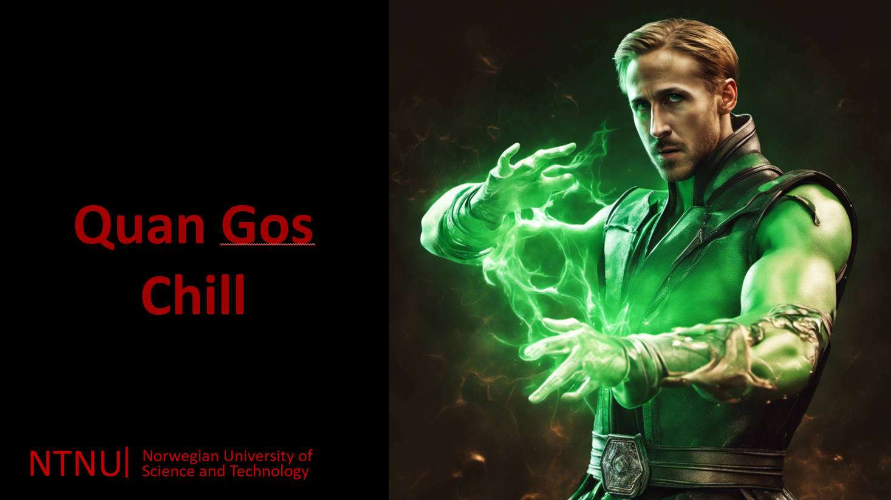
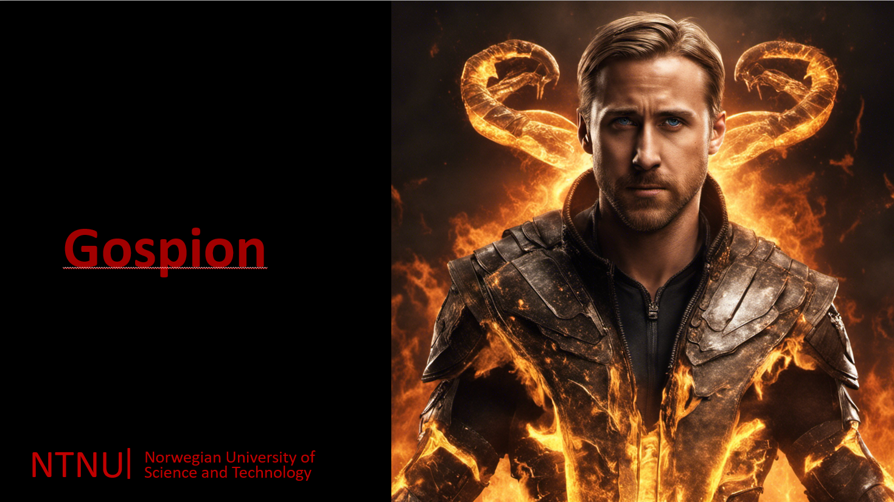
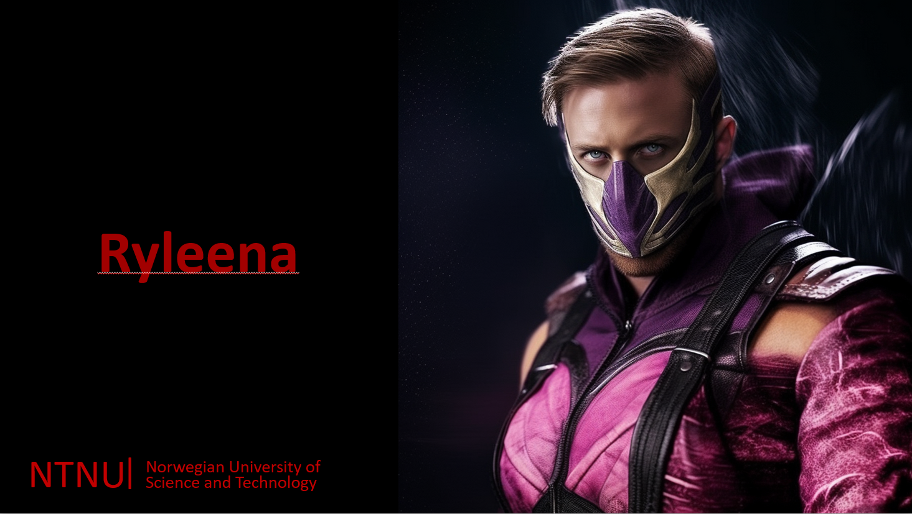
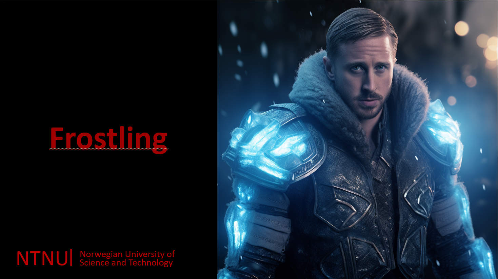

# ML power predictor  

<div align="center">


[](https://codecov.io/github/SverreNystad/power-predictor?branch=main)


[](https://img.shields.io/badge/version-0.0.1-blue)

</div>

<details>
  <summary> <b> Table of Contents </b> </summary>
  <ol>
    <li>
    <a href="#ML power predictor"> Power Predictor </a>
    </li>
    <li>
      <a href="#Introduction">Introduction</a>
    </li>
    </li>
    <li><a href="#Usage">Usage</a></li>
    <li><a href="#Installation">Installation</a>
      <ul>
        <li><a href="#Prerequisites">Prerequisites</a></li>
        <li><a href="#Setup">Setup</a></li>
      </ul>
    </li>
    <li><a href="#Tests">Tests</a></li>
    <li><a href="#license">License</a></li>
  </ol>
</details>

## Introduction


## Usage
After installing the project, run the jupyter notebook in the exploration directory of the project.


<details>
 The task was setup so we fight Machine learning algorithms that the professor Ruslan Khalitov have made.
 We have beaten the following bots:

  

  

  

  

  

  
</details>


## Installation
To install the Power Predictor, one needs to have all the prerequisites installed and set up, and follow the setup guild. The following sections will guide you through the process.
### Prerequisites
- Python 3.9 or higher
- Jupyter Notebook
  

### Setup
1. Clone the repository
```bash
git clone https://github.com/SverreNystad/power-predictor.git
cd power-predictor
```
2. Create and run a virtual environment.

    Create the virtual by running the following command.
    ```bash
    python -m venv venv
    ```
    To use the virtual environment run the following command
    #### On Windows:
    ```bash
    source venv/Scripts/activate
    ```
    #### On macOS and Linux: 
    ```bash
    source venv/bin/activate
    ```

3. Install the required packages
```bash
pip install -r requirements.txt
```

## Tests
To run all the tests, run the following command in the root directory of the project:
```bash
pytest --cov
coverage html # To generate a coverage report
```

## License
Licensed under the [MIT License](LICENSE). Because this is a template repository, you need to change the license if you want to use it for your own project.

## Folder Structure

### **Data:** All data used for the project.
* **data/raw:** Original, immutable data dump.
* **data/processed:** Cleaned and pre-processed data used for modeling.
* **data/external:** External data sources or additional datasets.
* **data/interim:** Intermediate data that has been transformed.

### **Exploration:** Jupyter notebooks for exploratory data analysis.


### **Results:** Generated analysis as HTML, PDF, LaTeX, etc.

### **src:** Source code for use in this project.
* **src/data:** Scripts to download or generate data. From Data/raw or Data/processed to object that can be worked with.
* **src/features:** Scripts to turn raw data into features for modeling.
* **src/models:** Scripts to train models and then use trained models to make predictions.
* **src/visualization:** Scripts to create exploratory and results oriented visualizations.

### **tests:** Unit tests for the project source code.

## Contributors
Three brave students that applied their knowledge of Machine Learning to beat the bots.


<table>
    <td align="center">
        <a href="https://github.com/Gunnar2908">
            <br />
            <sub><b>Gunnar Nystad</b></sub>
        </a>
    </td>
    <td align="center">
        <a href="https://github.com/pskoland">
            <br />
            <sub><b>Peter Skoland</b></sub>
        </a>
    </td>
    <td align="center">
        <a href="https://github.com/SverreNystad">
            <br />
            <sub><b>Sverre Nystad</b></sub>
        </a>
    </td>
  
  </tr>
</table>

# Thanks to

* [Ruslan Khalitov](https://github.com/RuslanKhalitov) for the task and the bots. This task has been amazing and we have learned a lot.
* Thanks to the group members for the great work and the good collaboration.
* Thanks to our amazing Professor Zhirong Yang for great lectures and help.