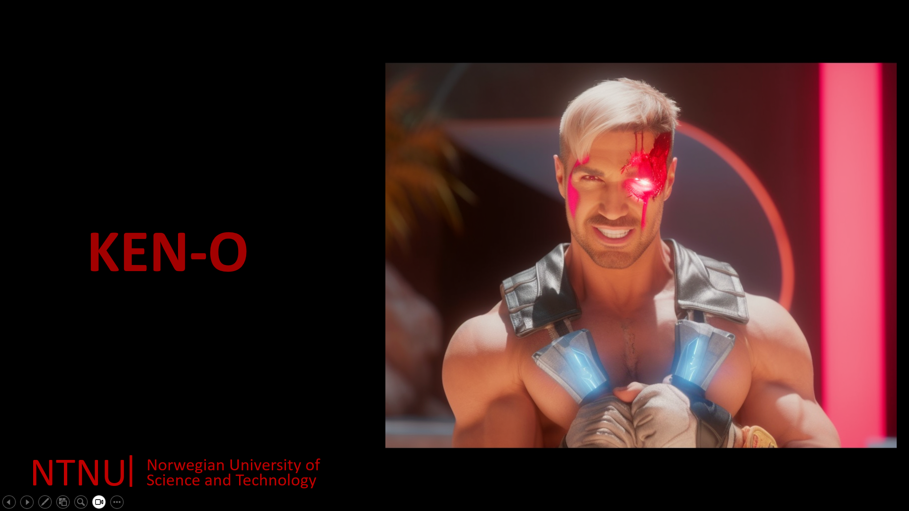

# ML power predictor  

<div align="center">


[](https://codecov.io/github/SverreNystad/power-predictor?branch=main)


[](https://img.shields.io/badge/version-0.0.1-blue)

</div>

<details>
  <summary> <b> Table of Contents </b> </summary>
  <ol>
    <li>
    <a href="#ML power predictor"> Power Predictor </a>
    </li>
    <li>
      <a href="#Introduction">Introduction</a>
    </li>
    </li>
    <li><a href="#Usage">Usage</a></li>
    <li><a href="#Installation">Installation</a>
      <ul>
        <li><a href="#Prerequisites">Prerequisites</a></li>
        <li><a href="#Setup">Setup</a></li>
      </ul>
    </li>
    <li><a href="#Tests">Tests</a></li>
    <li><a href="#license">License</a></li>
  </ol>
</details>

## Introduction


This is an machine learning program made for the subject TDT4173 Machine learning. The task was to find the how much solar power measured in Photovoltaic (PV) systems, which convert sunlight into electricity. This dataset provided data for evaluating solar production dayahead forecasting methods. The data provider is [ANEO](https://www.aneo.com/). With information about all weather features [here](https://www.meteomatics.com/en/api/available-parameters/alphabetic-list/). These Data was all collected in Trondheim. The data was collected from 2019-01-01 to 2023-07-31. The data was collected every 15 minutes. The data was collected from 3 different locations. These locations were not equal. The power output of location A was 6 times larger then B and C. Location A also had solar panals that were differently angled then B and C. Making it much more trick to make a model learn.
There was also much noise in the data, with outages and times during the night with zero sunlight that there was reported solar production, and also times at day were there was no power production due to external factors.

## Usage
After cloning the project, Look at the final submission folder to see the feature engineering and the model training. The final model is saved in the models folder. To use the model, run the following code in the root directory of the project.


The task was setup so we fight Machine learning algorithms that the professor Ruslan Khalitov have made.

[](docs/supergosling_lowres.mp4)
NB: Press the image to see the video of Goslightning Talking to Students at start of semester.

## Our journey
This has been a great task and we have learned a lot. We have learned how to use machine learning to solve a real world problem.
We have tried so many things, worked so many late nights and had a lot of fun, and many frustrations.
**In the end we managed to beat all the bots, and we are very proud of our work. This giving us the best grade possible: A**
The two bots that where the hardest to beat was Ryleena and Shao-RyKhan. This seems a bit strange as Goslightning is the best bot in the entire tournament, but the reason for this was that most of the project we had tried to to predictions on Kaggle (where we were graded) with bugs in the way we got the test data. This made us think that the bots were better than they actually were. We worked so hard on data that was flawed. It is very impressive that we climbed so high with several flaws in our test data. After fixing that we defeated Ryleena. 

We learned that simpler models better models, as we had models so complex that they required to be ran for more then 24 hours before completion. We also learned that the data is the most important part of the project. We spent so much time on feature engineering and data cleaning. We also learned that it is important to have a good workflow, and that it is important to have a good structure of the project. We learned that cloud computing is very powerful and quite easy to setup.
<details>
  <summary><b> We have beaten the following bots: </b></summary>

  
The Gosborg 2049 VT was random guessing between 0 and max pv measurement.
  
Linear Regression, with no feature engineering.
  
Average for each location + hour
  
Random Forest with minial feature engineering.
  
AutoML, some feature engineering and random split.
  
Frostling used CatBoost with good feature engineering and good hyperparams.
  
La La Lizard was the avereage of two teaching assistans models 
  
Keno used a single LightGBM with with change target and extensive hyperparameters search. It used one model for all 3 locations.
  
Shao TyKhan was made by using one of the best teaching assistants models, then averageing 10 different CatBoost models, having great hyper parameters and good feature engineering. But different to the other Virtual Teams was that it used one model for each location. 
  
  Goslightning was the best model that the professor made. This model had extended time to be finished. It used Geometric mean of 10 models from the teaching assistanst, 1 model averaged from other teaching assistanst solutions, 2 LightGBM models from the professor. The 
</details>


## Installation
To install the Power Predictor, one needs to have all the prerequisites installed and set up, and follow the setup guild. The following sections will guide you through the process.
### Prerequisites
- Python 3.9 or higher
- Jupyter Notebook
  

### Setup
1. Clone the repository
```bash
git clone https://github.com/SverreNystad/power-predictor.git
cd power-predictor
```
2. Create and run a virtual environment.

    Create the virtual by running the following command.
    ```bash
    python -m venv venv
    ```
    To use the virtual environment run the following command
    #### On Windows:
    ```bash
    source venv/Scripts/activate
    ```
    #### On macOS and Linux: 
    ```bash
    source venv/bin/activate
    ```

3. Install the required packages
```bash
pip install -r requirements.txt
```

## Tests
To run all the tests, run the following command in the root directory of the project:
```bash
pytest --cov
coverage html # To generate a coverage report
```

## License
Licensed under the [MIT License](LICENSE). Because this is a template repository, you need to change the license if you want to use it for your own project.

## Folder Structure

### **Data:** All data used for the project.
* **data/raw:** Original, immutable data dump.
* **data/processed:** Cleaned and pre-processed data used for modeling.
* **data/external:** External data sources or additional datasets.
* **data/interim:** Intermediate data that has been transformed.

### **Exploration:** Jupyter notebooks for exploratory data analysis.


### **Results:** Generated analysis as HTML, PDF, LaTeX, etc.

### **src:** Source code for use in this project.
* **src/data:** Scripts to download or generate data. From Data/raw or Data/processed to object that can be worked with.
* **src/features:** Scripts to turn raw data into features for modeling.
* **src/models:** Scripts to train models and then use trained models to make predictions.
* **src/visualization:** Scripts to create exploratory and results oriented visualizations.

### **tests:** Unit tests for the project source code.

## Contributors
Three brave students that applied their knowledge of Machine Learning to beat the bots.


<table>
    <td align="center">
        <a href="https://github.com/Gunnar2908">
            <br />
            <sub><b>Gunnar Nystad</b></sub>
        </a>
    </td>
    <td align="center">
        <a href="https://github.com/pskoland">
            <br />
            <sub><b>Peter Skoland</b></sub>
        </a>
    </td>
    <td align="center">
        <a href="https://github.com/SverreNystad">
            <br />
            <sub><b>Sverre Nystad</b></sub>
        </a>
    </td>
  
  </tr>
</table>

# Thanks to

* [Ruslan Khalitov](https://github.com/RuslanKhalitov) for the task and the bots. This task has been amazing and we have learned a lot.
* Thanks to the group members for the great work and the good collaboration.
* Thanks to our amazing Professor Zhirong Yang for great lectures and help.
