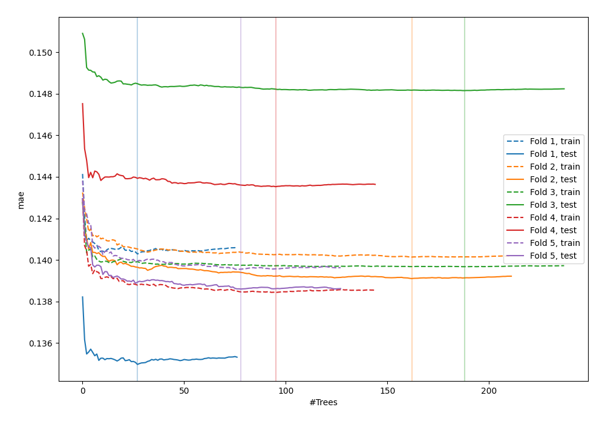
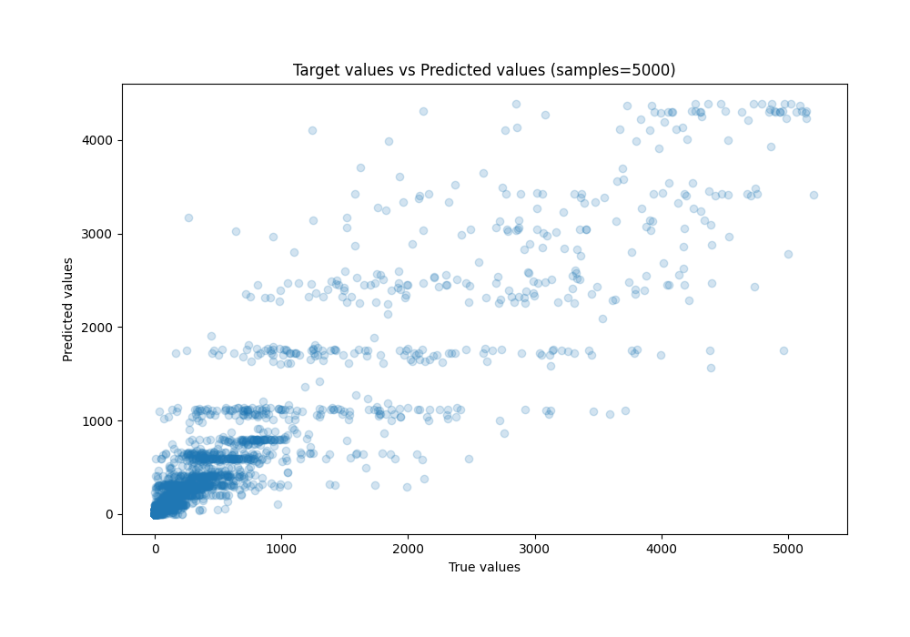
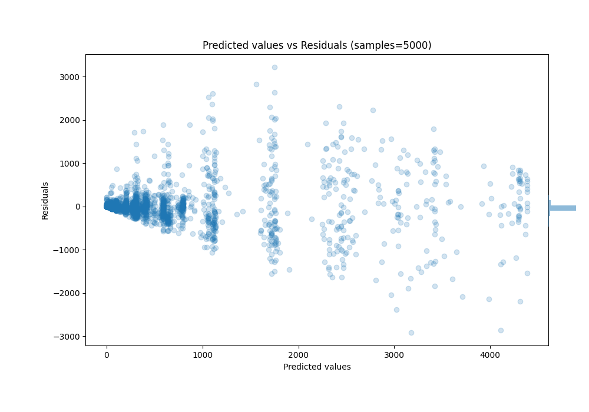

# Summary of 32_RandomForest

[<< Go back](../README.md)

## Random Forest
- **n_jobs**: -1
- **criterion**: squared_error
- **max_features**: 1.0
- **min_samples_split**: 40
- **max_depth**: 4
- **eval_metric_name**: mae
- **explain_level**: 0

## Validation
 - **validation_type**: kfold
 - **k_folds**: 5
 - **shuffle**: True
 - **random_seed**: 42

## Optimized metric
mae

## Training time

77.8 seconds

### Metric details:
| Metric   |            Score |
|:---------|-----------------:|
| MAE      |    113.825       |
| MSE      | 100597           |
| RMSE     |    317.171       |
| R2       |      0.845981    |
| MAPE     |      5.05686e+15 |

## Learning curves

## True vs Predicted

## Predicted vs Residuals

[<< Go back](../README.md)
