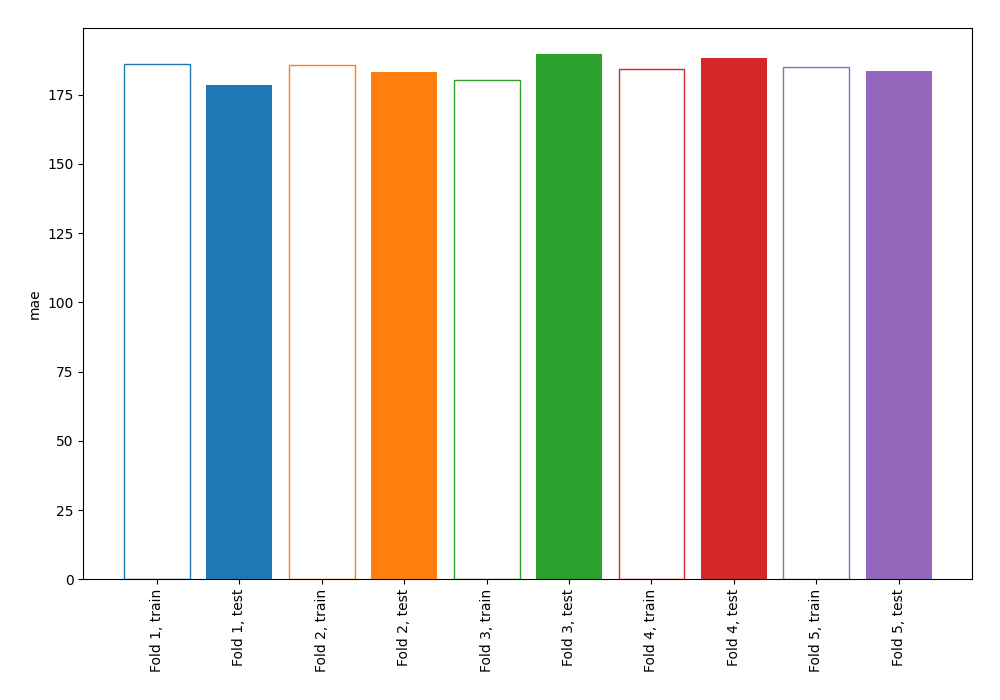
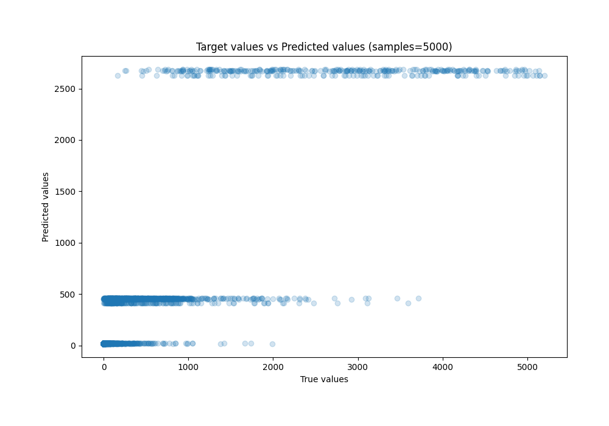
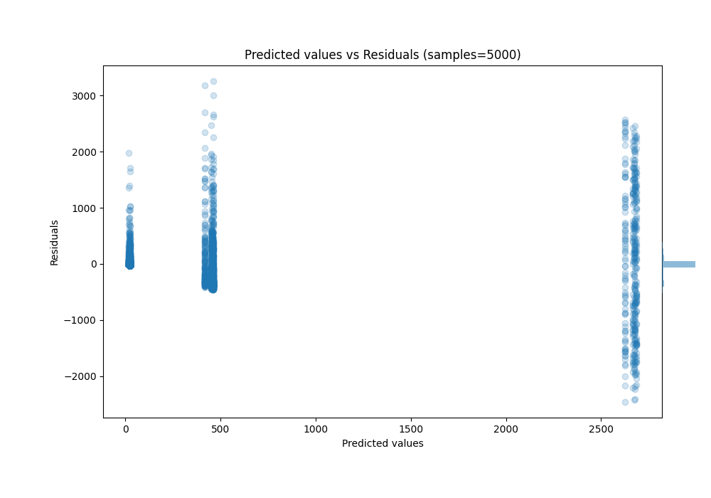

# Summary of 3_DecisionTree

[<< Go back](../README.md)

## Decision Tree
- **n_jobs**: -1
- **criterion**: squared_error
- **max_depth**: 2
- **explain_level**: 0

## Validation
 - **validation_type**: kfold
 - **k_folds**: 5
 - **shuffle**: True
 - **random_seed**: 42

## Optimized metric
mae

## Training time

2.3 seconds

### Metric details:
| Metric   |            Score |
|:---------|-----------------:|
| MAE      |    184.628       |
| MSE      | 186820           |
| RMSE     |    432.227       |
| R2       |      0.71397     |
| MAPE     |      5.22375e+16 |

## Learning curves

## True vs Predicted

## Predicted vs Residuals

[<< Go back](../README.md)
