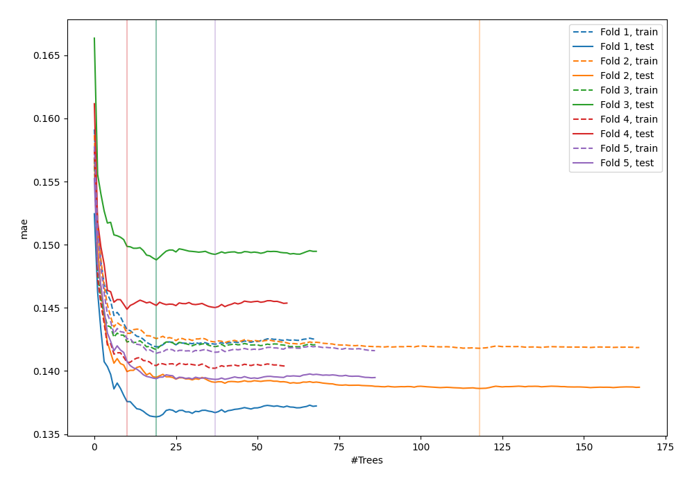
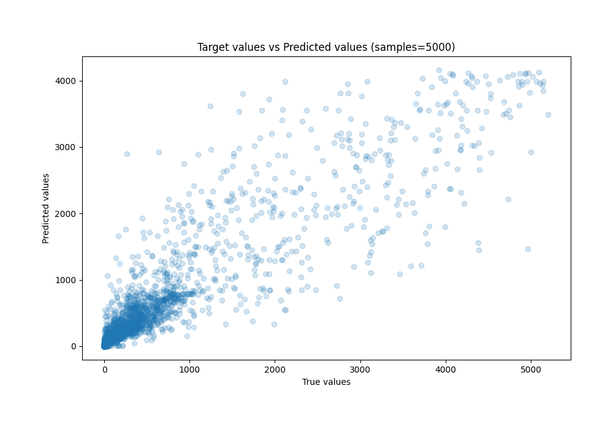
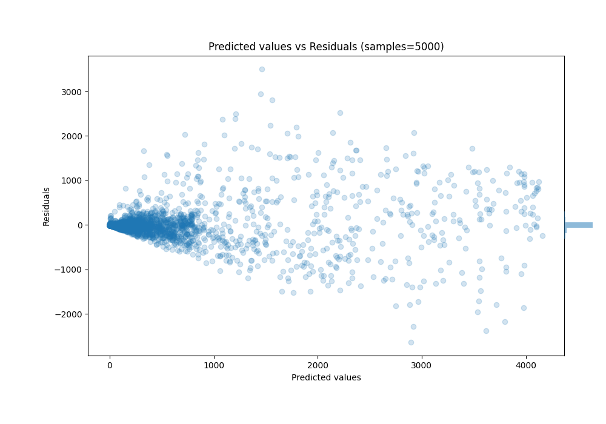

# Summary of 41_ExtraTrees

[<< Go back](../README.md)

## Extra Trees Regressor (Extra Trees)
- **n_jobs**: -1
- **criterion**: squared_error
- **max_features**: 1.0
- **min_samples_split**: 40
- **max_depth**: 4
- **eval_metric_name**: mae
- **explain_level**: 0

## Validation
 - **validation_type**: kfold
 - **k_folds**: 5
 - **shuffle**: True
 - **random_seed**: 42

## Optimized metric
mae

## Training time

10.8 seconds

### Metric details:
| Metric   |           Score |
|:---------|----------------:|
| MAE      |   114.416       |
| MSE      | 99665.9         |
| RMSE     |   315.699       |
| R2       |     0.847407    |
| MAPE     |     7.72575e+15 |

## Learning curves

## True vs Predicted

## Predicted vs Residuals

[<< Go back](../README.md)
