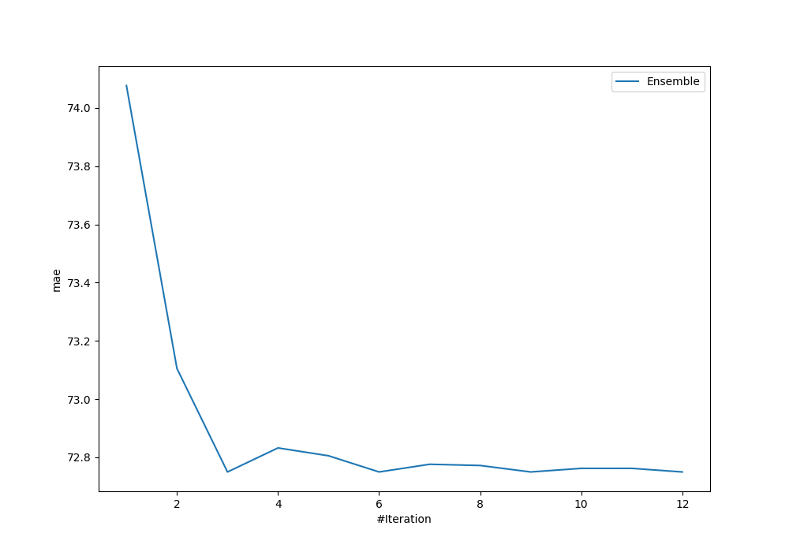
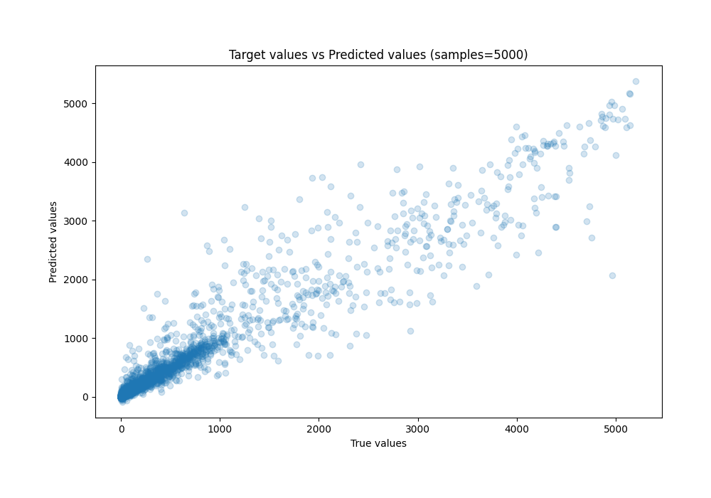
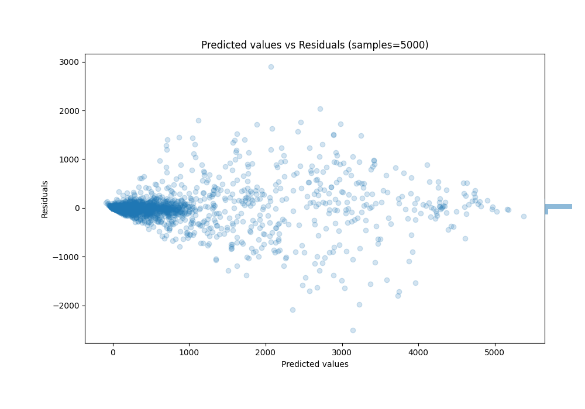

# Summary of Ensemble

[<< Go back](../README.md)

## Ensemble structure
| Model                      |   Weight |
|:---------------------------|---------:|
| 23_CatBoost_GoldenFeatures |        2 |
| 4_Default_LightGBM         |        4 |

### Metric details:
| Metric   |           Score |
|:---------|----------------:|
| MAE      |    72.7494      |
| MSE      | 49367.6         |
| RMSE     |   222.188       |
| R2       |     0.924416    |
| MAPE     |     5.44615e+15 |

## Learning curves

## True vs Predicted

## Predicted vs Residuals

[<< Go back](../README.md)
