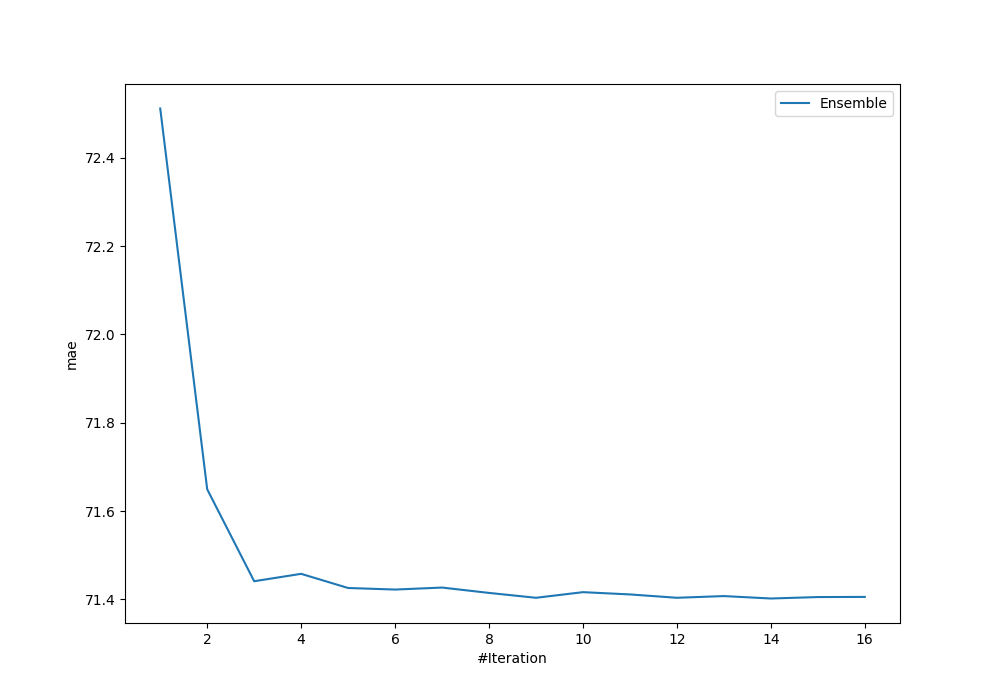
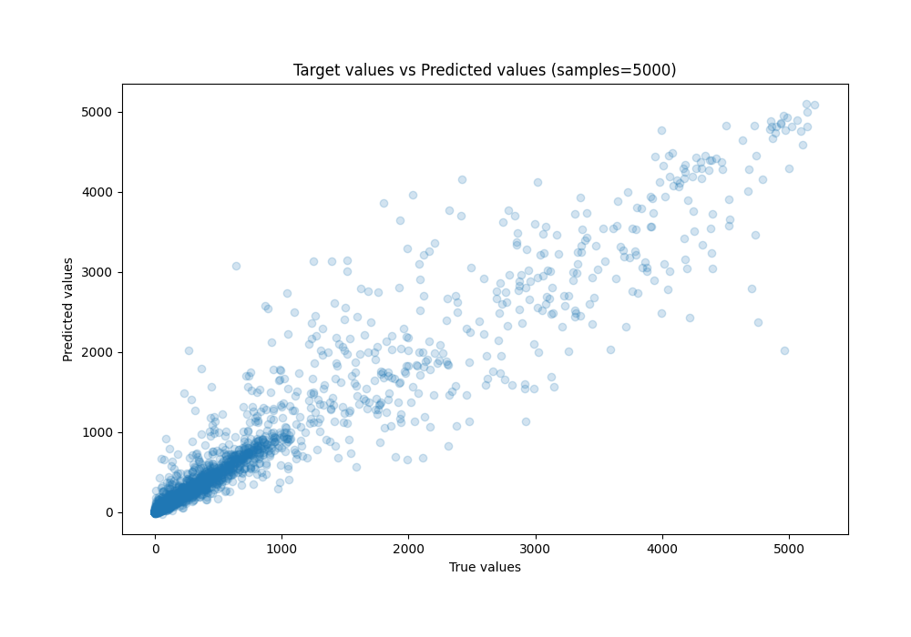
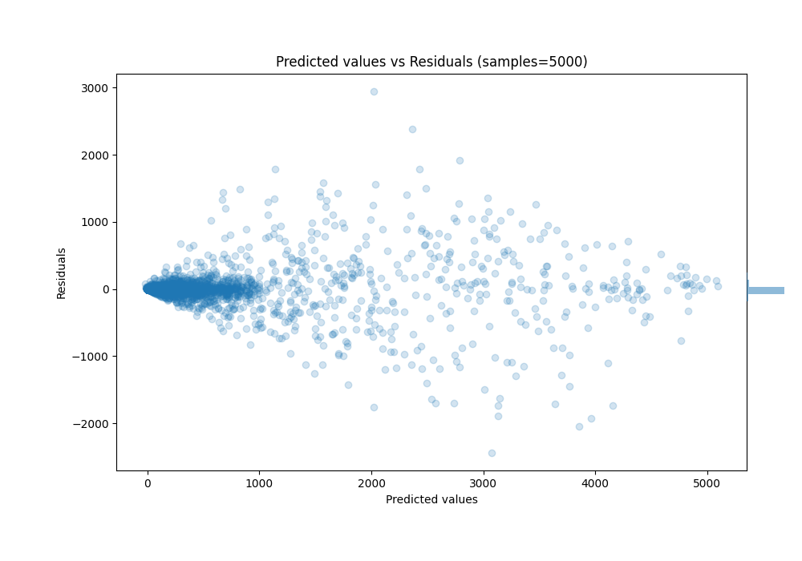

# Summary of Ensemble_Stacked

[<< Go back](../README.md)

## Ensemble structure
| Model                              |   Weight |
|:-----------------------------------|---------:|
| 23_CatBoost_GoldenFeatures_Stacked |        3 |
| 4_Default_LightGBM                 |        1 |
| 4_Default_LightGBM_Stacked         |        1 |
| 5_Xgboost_Stacked                  |        5 |
| Ensemble                           |        4 |

### Metric details:
| Metric   |           Score |
|:---------|----------------:|
| MAE      |    71.4022      |
| MSE      | 49488.6         |
| RMSE     |   222.46        |
| R2       |     0.924231    |
| MAPE     |     2.92355e+15 |

## Learning curves

## True vs Predicted

## Predicted vs Residuals

[<< Go back](../README.md)
