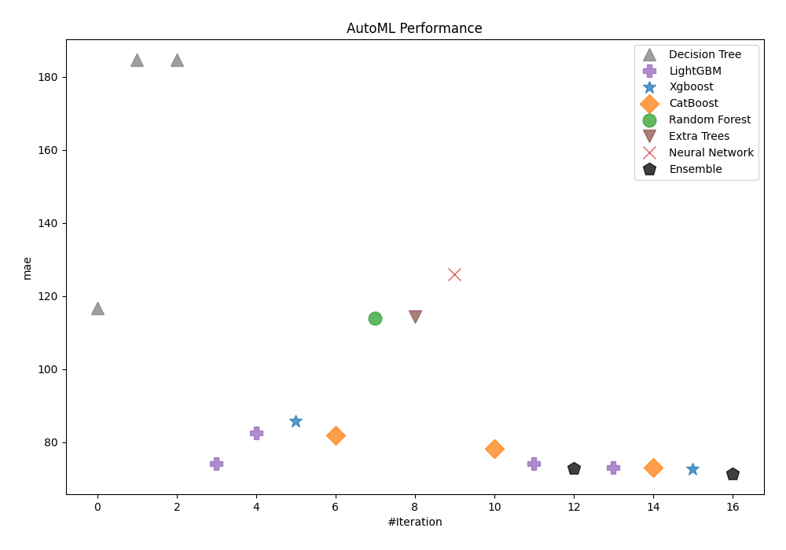
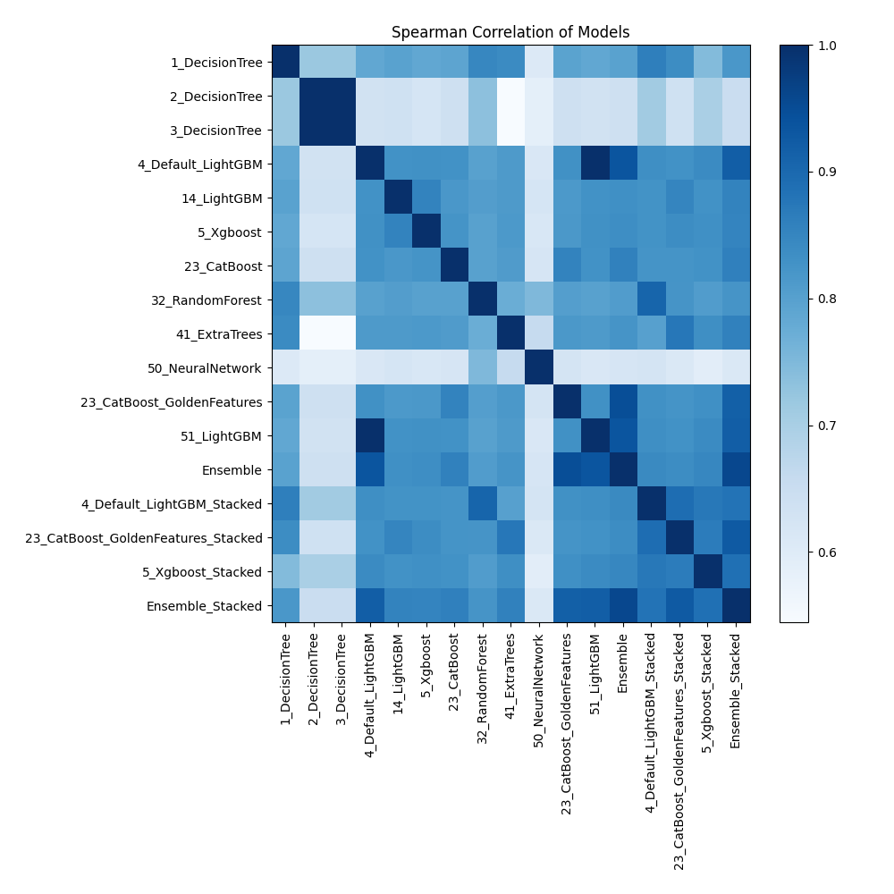

# AutoML Leaderboard

| Best model   | name                                                                               | model_type     | metric_type   |   metric_value |   train_time |
|:-------------|:-----------------------------------------------------------------------------------|:---------------|:--------------|---------------:|-------------:|
|              | [1_DecisionTree](1_DecisionTree/README.md)                                         | Decision Tree  | mae           |       116.688  |         4.1  |
|              | [2_DecisionTree](2_DecisionTree/README.md)                                         | Decision Tree  | mae           |       184.628  |         2.67 |
|              | [3_DecisionTree](3_DecisionTree/README.md)                                         | Decision Tree  | mae           |       184.628  |         2.64 |
|              | [4_Default_LightGBM](4_Default_LightGBM/README.md)                                 | LightGBM       | mae           |        74.077  |       326.28 |
|              | [14_LightGBM](14_LightGBM/README.md)                                               | LightGBM       | mae           |        82.6151 |        33.65 |
|              | [5_Xgboost](5_Xgboost/README.md)                                                   | Xgboost        | mae           |        85.692  |        10.32 |
|              | [23_CatBoost](23_CatBoost/README.md)                                               | CatBoost       | mae           |        81.7878 |        80.81 |
|              | [32_RandomForest](32_RandomForest/README.md)                                       | Random Forest  | mae           |       113.825  |        78.16 |
|              | [41_ExtraTrees](41_ExtraTrees/README.md)                                           | Extra Trees    | mae           |       114.416  |        11.26 |
|              | [50_NeuralNetwork](50_NeuralNetwork/README.md)                                     | Neural Network | mae           |       125.898  |        51.84 |
|              | [23_CatBoost_GoldenFeatures](23_CatBoost_GoldenFeatures/README.md)                 | CatBoost       | mae           |        78.2389 |       252.61 |
|              | [51_LightGBM](51_LightGBM/README.md)                                               | LightGBM       | mae           |        74.077  |       303.06 |
|              | [Ensemble](Ensemble/README.md)                                                     | Ensemble       | mae           |        72.7494 |         0.17 |
|              | [4_Default_LightGBM_Stacked](4_Default_LightGBM_Stacked/README.md)                 | LightGBM       | mae           |        72.9645 |        18.15 |
|              | [23_CatBoost_GoldenFeatures_Stacked](23_CatBoost_GoldenFeatures_Stacked/README.md) | CatBoost       | mae           |        73.1521 |         8.43 |
|              | [5_Xgboost_Stacked](5_Xgboost_Stacked/README.md)                                   | Xgboost        | mae           |        72.5116 |         6.32 |
| **the best** | [Ensemble_Stacked](Ensemble_Stacked/README.md)                                     | Ensemble       | mae           |        71.4022 |         0.26 |

### AutoML Performance

### AutoML Performance Boxplot

### Spearman Correlation of Models

